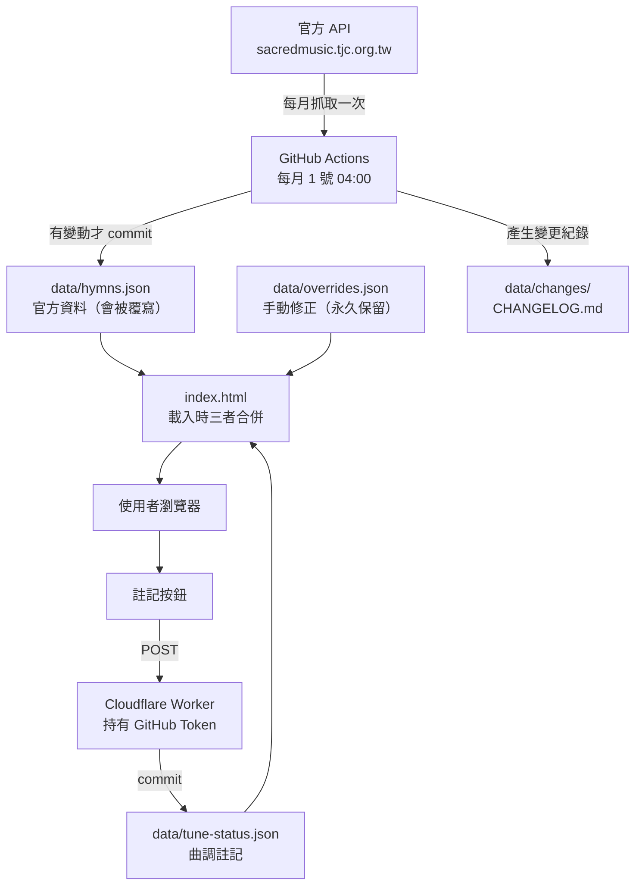

# 讚美詩網站

真耶穌教會讚美詩 474 首的線上查詢與播放網站。歌詞、樂譜、音檔、背景介紹一站呈現，並可標註各首人聲音檔的曲調版本。

**線上網址：** https://tjc-km.github.io/hymns/

---

## 目錄

- [設計目標](#設計目標)
- [使用說明（給一般使用者）](#使用說明給一般使用者)
- [運作原理](#運作原理)
- [維護說明（給維護者）](#維護說明給維護者)
- [疑難排解](#疑難排解)
- [已知限制](#已知限制)

---

## 設計目標

| 目標 | 做法 | 為什麼 |
|------|------|--------|
| **零維運成本** | 純靜態 HTML，部署於 GitHub Pages | 不需要伺服器、資料庫或月費，交接時不會因為沒人續費而消失 |
| **資料不落後** | 每月自動從官方 API 同步一次 | 官方新增或修正詩歌時會自動跟上，且變更有紀錄可查 |
| **不打擾官方伺服器** | 資料同步進本 repo，網站讀自己的檔案 | 一個月一個請求；也避開瀏覽器直接呼叫官方 API 的跨網域限制 |
| **手動修正不會被蓋掉** | 手動內容集中在 `data/overrides.json`，同步永不觸碰 | 重新斷行的歌詞、替換的音檔可以長期保留 |
| **曲調問題可追蹤** | 曲調註記系統（標準版／有間奏／特別版） | 部分官方人聲音檔與信徒熟悉的唱法不同，需要標示提醒 |
| **聚會現場好用** | 電腦模式大字、兩節並排、播放速度調整 | 投影或帶領練唱時看得清楚、跟得上 |

---

## 使用說明（給一般使用者）

### 詩歌列表（首頁）

- **搜尋**：輸入編號、詩歌名，或任何一句歌詞都能找到。甲乙版可輸入 `51甲` 或 `51_a`
- **篩選標籤**：
  - `標準版` / `特別版` — 依曲調註記篩選（見下方說明）
  - 其餘為官方分類（讚美天父、耶穌降生⋯）
- 每首右側的彩色標籤即曲調註記，音符圖示代表有音檔

### 詩歌內頁

| 區塊 | 說明 |
|------|------|
| **播放器** | 上方按鈕切換音檔版本（四部合唱 → 人聲 → 鋼琴 → 各分部）。點進度條可跳轉 |
| **播放速度** | `0.5×` ～ `1.5×`，練唱時放慢很實用。切換音檔版本時速度會保留 |
| **曲調註記** | 見下一節 |
| **歌詞** | 有副歌的詩歌，每一節後面都會重複顯示副歌，方便直接跟唱 |
| **樂譜 / YouTube** | 五線譜、簡譜 PDF 另開視窗；有影片連結時一併列出 |
| **背景介紹** | 點開可看該首詩歌的歷史背景 |
| **上一首 / 下一首** | 頁面最下方 |

### 曲調註記（任何人都可以標）

官方的「人聲」音檔有些是改編過的版本，與信徒熟悉的唱法不同。詩歌內頁播放器下方可標記三種狀態：

| 註記 | 意思 |
|------|------|
| **標準版** | 就是平常唱的版本 |
| **有間奏** | 大致相同，但多了間奏或裝飾 |
| **特別版** | 明顯改編，與熟悉的唱法差異較大 |
| （未註記） | 還沒有人標記過 |

- **點下去就直接存檔**，不需要帳號或密碼，全站所有人都看得到更新結果（下次載入頁面時生效）
- **有四部合唱的詩歌自動視為「標準版」**，不會出現按鈕——因為播放器預設就播四部合唱，沒有曲調疑慮
- 標錯了直接改成別的狀態，或點「未註記」清除即可

### 手機版 / 電腦版切換

右上角的 `📱 手機版` / `🖥 電腦版` 按鈕可手動切換，選擇會被記住。沒手動選過時，依視窗寬度自動判斷（1000px 以上為電腦版）。

電腦版特色：內容滿版、歌詞 32px 大字置中、一列兩節並排、詩歌列表雙欄。

### 最近更新

右上角「最近更新」可查看每次自動同步的結果：資料更新時間、新增／異動／移除了哪些詩歌，點開有詳細項目（例如「新增音檔:四部合唱-3部」）。

### 效能監控列（診斷卡頓用）

電腦版右上角有一排小字，例如 `60fps　卡2　忙×2.3　45MB　4g 10M　↓3.2MB`：

| 顯示 | 意思 | 判讀 |
|------|------|------|
| `60fps` | 畫面更新率 | 掉到 30 以下代表畫面在卡（分頁未顯示時會歸零，屬正常） |
| `卡n` | 主執行緒被單一工作卡住超過 50ms 的次數 | 有出現＝網站程式本身造成的卡頓，可回報維護者 |
| `掉120ms` | 這一秒內最久的一次停頓 | 超過 100ms 變橘色，代表肉眼可見的頓挫 |
| `忙×2.3` | CPU 忙碌倍率（見運作原理） | **×3 以上變橘色＝電腦 CPU 嚴重不足**，常見於同時開視訊會議分享畫面時 |
| `45MB` | 本網頁佔用的記憶體 | 若長時間使用一路上升到數百 MB，代表有問題 |
| `4g 10M` | 連線品質估計 | 音檔播放斷續時看這裡，數字低就是網路問題 |
| `↓3.2MB` | 本次瀏覽已下載的資料量 | 首次載入約 3MB，每播一首音檔增加數 MB |

**用途舉例**：投影分享詩歌時卡頓，若 `忙×3` 以上就是電腦效能不足（可改成分享分頁而非整個螢幕、關閉鏡頭與背景程式）；若沒有 `忙` 也沒有 `卡`，那卡頓來自網路或會議軟體本身，換電腦也解決不了。

> 這些是「本網頁」的指標，不是整台電腦的數據（瀏覽器基於隱私不開放系統資訊）。要精確判斷仍建議搭配工作管理員。`卡n` 與記憶體僅 Chrome／Edge 支援；螢幕寬度小於 700px 時整列隱藏。

---

## 運作原理

### 整體架構



### 三層資料合併

網站載入時依序做三件事：

1. 讀 `data/hymns.json`（474 首官方資料）
2. 套用 `data/overrides.json`：
   - 欄位名稱**照原樣** → **整欄取代**（例：`lyrics` 換成重新斷行的版本）
   - 欄位名稱**加 `+`** → **附加**在官方清單後（例：`audio_files+` 加入自製錄音）
3. 讀 `data/tune-status.json` 決定各首的曲調註記

因為覆蓋是在**瀏覽器端**合併，同步腳本完全不需要知道 overrides 的存在，兩者互不干擾。

### 曲調註記的判定順序

```
有四部合唱音檔（audio_category_id = 6）？
   ├─ 是 → 標準版（自動判定，不可手動更改）
   └─ 否 → 看 tune-status.json 的人工註記，沒有就是「未註記」
```

**自動判定優先於人工註記**。因此當總會日後補上某首的四部合唱音檔，該首會自動轉為標準版，不需要有人回頭維護。

### 註記如何存檔（Cloudflare Worker）

網站是純靜態的，瀏覽器不能直接寫檔案回 repo。若把 GitHub Token 寫進網頁，等於公開 repo 的寫入權（且 GitHub 的密鑰掃描會自動撤銷它）。因此：

1. 使用者點按鈕 → 網站 POST `{no, val}` 給 Cloudflare Worker
2. Worker 嚴格驗證（編號格式、只接受三種狀態，呼叫者無法寫入任意內容）
3. Worker 用存在 Cloudflare Secret 的 Token，讀取最新檔案、合併、commit 回 repo（遇到同時修改會自動重試）

Token 只存在 Cloudflare，前端完全接觸不到。

### 自動同步機制

- 每月 1 號台灣時間 04:00 執行（`.github/workflows/sync-hymns.yml`），也可在 Actions 分頁手動觸發
- `scripts/sync.mjs` 抓取官方列表端點一次取得全部 474 首，依 `id` 排序後覆寫 `data/hymns.json`
- 與上一版逐欄比對，產生 `data/changes/{日期}.json`、`data/changes/index.json` 與 `CHANGELOG.md`
- **有變動才 commit**；API 回傳空資料時中止，不會用空資料覆蓋

### 效能監控的原理

- **fps**：每秒累計 `requestAnimationFrame` 的回呼次數
- **卡n**：`PerformanceObserver` 監聽 `longtask`（主執行緒被佔用超過 50ms 的工作）
- **掉xxms**：每秒內最大的兩幀間隔
- **忙×n**：每秒跑一段固定運算（30 萬次開根號），與「歷來最快一次」相比慢了幾倍。其他程式吃滿 CPU 時同樣的運算會變慢，藉此間接推測整機負載。取近三次的中位數以濾除單次雜訊
- **↓MB**：`performance.getEntriesByType('resource')` 的 `transferSize` 總和

---

## 維護說明（給維護者）

### 檔案結構

| 路徑 | 用途 | 誰會改它 |
|------|------|---------|
| `index.html` | **整個網站**（HTML／CSS／JS 全在這一個檔） | 維護者手動 |
| `data/hymns.json` | 官方資料 2.7MB，474 首 | **只有自動同步**，不要手改 |
| `data/overrides.json` | 手動修正的歌詞／音檔 | 維護者手動 |
| `data/tune-status.json` | 曲調註記 | 網站按鈕自動寫入，也可手改 |
| `data/meta.json` | 最後同步時間、總數 | 自動同步 |
| `data/changes/` | 每次同步的變更明細 | 自動同步 |
| `CHANGELOG.md` | 人類可讀的變更史 | 自動同步 |
| `assets/church-bg.png` | 背景圖 | 少動 |
| `assets/audio/` | 自製或替換用音檔 | 維護者手動 |
| `scripts/sync.mjs` | 同步腳本 | 少動 |
| `.github/workflows/sync-hymns.yml` | 排程設定 | 少動 |
| `workers/tune-status-worker.js` | Worker 原始碼（**改完要手動重新部署**） | 少動 |

> `index.html` 修改後推上 GitHub，約一兩分鐘 Pages 會自動部署。

### 常見維護工作

#### 1. 修改歌詞排版

編輯 `data/overrides.json`，以詩歌編號為 key：

```json
{
  "345": {
    "lyrics": [
      { "text": "第一節第一行\r\n第一節第二行\r\n第三行\r\n第四行" },
      { "text": "第二節…" }
    ]
  }
}
```

- 每節一個元素，**行與行之間用 `\r\n`**
- 這是整欄取代，官方原本的分節會被完全捨棄

#### 2. 移除不該存在的副歌

有些詩歌的官方 `lyrics_chorus` 只是重複句，不是真正的副歌：

```json
"399": { "lyrics_chorus": "" }
```

空字串等於「沒有副歌」，網站就不會顯示副歌區塊。

#### 3. 替換異常的音檔

1. 音檔放進 `assets/audio/`，建議命名 `{編號}-vocal.mp3`
2. 在 overrides 整欄取代 `audio_files`——**注意要保留的官方音檔也得一起寫進去**，否則會消失：

```json
"62": {
  "audio_files": [
    {
      "id": 63,
      "file_url": "https://sacredmusic.tjc.org.tw/storage/uploads/hymn/audio/62.m4a",
      "audio_category_id": 3,
      "audio_category": { "id": 3, "name": "鋼琴" }
    },
    {
      "id": "custom-62-vocal",
      "file_url": "assets/audio/62-vocal.mp3",
      "audio_category_id": 4,
      "audio_category": { "id": 4, "name": "人聲" }
    }
  ]
}
```

官方音檔的 `file_url` 可從 `data/hymns.json` 查到。

#### 4. 額外增加音檔（不取代官方的）

欄位加 `+` 表示附加：

```json
"96": {
  "audio_files+": [{
    "id": "custom-1",
    "file_url": "assets/audio/96-choir.mp3",
    "audio_category_id": 99,
    "audio_category": { "id": 99, "name": "詩班錄音" }
  }]
}
```

自訂 `id` 用字串避免與官方主鍵相撞；`audio_category_id` 99 會排在切換按鈕最後。

#### 5. 音檔分類代碼對照

| id | 名稱 | 播放器排序 |
|----|------|-----------|
| 6 | 四部合唱 | 第 1 |
| 4 | 人聲 | 第 2 |
| 3 | 鋼琴 | 之後依 id 升冪 |
| 7–10 | 四部合唱 1–4 部 | |
| 11–14 | 合唱 1–4 部 | |

程式判斷一律用 `audio_category_id`，不要比對中文名稱。

#### 6. 手動觸發同步

GitHub → Actions → `sync-hymns` → Run workflow。若 push 失敗，檢查 Settings → Actions → General → Workflow permissions 是否為 **Read and write**。

> GitHub 會停用閒置超過 60 天的排程。若長期沒有任何 commit，需到 Actions 頁面重新啟用。

### ⚠️ 編輯 JSON 的常見錯誤

**陣列或物件的最後一個元素後面不能有逗號**——這是目前為止最常犯的錯誤，會讓整份檔案失效。

改完務必驗證：

```bash
node -e "JSON.parse(require('fs').readFileSync('data/overrides.json','utf8')); console.log('OK')"
```

若 `overrides.json` 語法錯誤，網站會在畫面下方跳紅色提示「格式錯誤，本次未套用手動修改」並改用官方資料，**不會白畫面**，但你的修改全部失效。

### Cloudflare Worker 維護

| 項目 | 內容 |
|------|------|
| Worker 網址 | 見 `index.html` 的 `TUNE_API` 常數 |
| Secret 名稱 | `GITHUB_TOKEN`（fine-grained PAT，只授權本 repo 的 Contents 讀寫） |
| **改完程式要重新部署** | Cloudflare → 該 Worker → Edit code → 貼上 `workers/tune-status-worker.js` 全部內容 → Deploy |
| **Token 會過期** | 到期後註記按鈕會顯示「儲存失敗」。到 GitHub 重新產生 PAT，再到 Worker 的 Settings → Variables and Secrets 更新 `GITHUB_TOKEN` 即可，網站程式不用動 |

新增或修改曲調狀態名稱時，**前端的 `TUNE_VALS` 與 Worker 的驗證清單必須同步修改並重新部署**，否則按鈕會存檔失敗。

### 樣式與版面的修改位置

全部在 `index.html` 的 `<style>` 區塊：

| 想改什麼 | 找哪裡 |
|---------|-------|
| 配色 | 最上方 `:root` 與 `@media (prefers-color-scheme: dark)` |
| 電腦版歌詞字級 | `body.desktop .vt` / `.chorus p`（目前 32px） |
| 電腦版／手機版分界 | JS 的 `MQ_DESKTOP`（目前 1000px） |
| 曲調標籤顏色 | `.badge.vari`（特別版）、`.badge.pol`（有間奏） |
| 播放速度選項 | JS 中的 `[0.5,0.75,1,1.25,1.5]` |
| 效能監控列 | JS 最下方的 perf monitor 區塊；不想要可整段刪除 |

### 本機預覽

```bash
python -m http.server 8642
```

然後開 http://localhost:8642/index.html 。**不能直接用檔案總管開 `index.html`**（`file://` 協定下 fetch 會被瀏覽器擋住，資料載不進來）。

---

## 疑難排解

| 症狀 | 可能原因與處理 |
|------|--------------|
| 網站顯示「找不到 data/hymns.json」 | 用 `file://` 開啟了，改用本機伺服器；或資料檔真的不存在 |
| 畫面下方跳紅色「overrides.json 格式錯誤」 | JSON 語法錯誤（多半是多餘的逗號），用上面的指令驗證 |
| 曲調註記按了沒反應／顯示儲存失敗 | ① Worker 未部署最新版（狀態名稱不符）② PAT 過期 ③ Cloudflare 服務異常 |
| 手動改了歌詞但網站沒變 | 改到 `data/hymns.json` 了（會被同步覆寫且被 overrides 遮蔽），應改 `data/overrides.json` |
| 官方更新了某首但網站看不到 | 該首被 overrides 整欄覆蓋了。查「最近更新」頁確認異動內容，再手動更新 overrides |
| 音檔播不出來 | 檢查 `file_url` 路徑；自製音檔要確認已 commit 進 repo |
| 推送 GitHub 被拒（403） | 帳號權限不足。多帳號環境需將帳號綁進 remote 網址：`git remote set-url origin https://<帳號>@github.com/TJC-KM/hymns.git` |

---

## 已知限制

- **`data/hymns.json` 約 2.7MB 一次載入**：首次開啟需等待較久。若日後嫌慢，可在 `sync.mjs` 另產一份精簡索引給列表頁，或拆成每首一檔
- **overrides 是整欄覆蓋**：被覆蓋的欄位不會反映官方後續更新，需靠「最近更新」頁人工察覺
- **音檔與樂譜直連官方伺服器**：等於使用對方頻寬，流量大時應考慮鏡像
- **曲調註記無權限控管**：任何訪客都能修改。防護是 Worker 只接受這一種操作、且 git 歷史可完整還原。若日後遭亂改，可加共用密碼
- **效能監控只反映本網頁**：無法取得整台電腦的真實 CPU／記憶體用量
- **甲乙版編號含底線**（如 `51_a`）：處理編號的程式需相容非純數字格式
